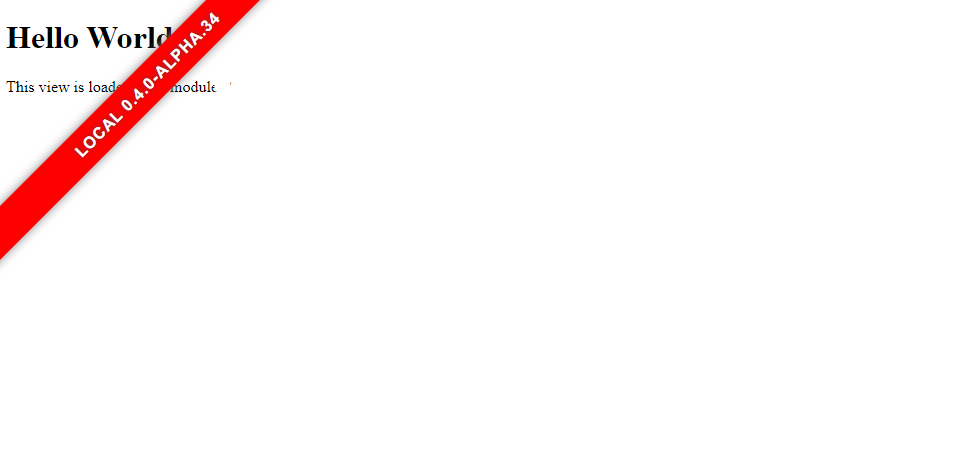

<!-- @format -->

# Laravel Env Ribbon

[](https://packagist.org/packages/perspikapps/laravel-envribbon)
[](https://packagist.org/packages/perspikapps/laravel-envribbon)
[](https://packagist.org/packages/perspikapps/laravel-envribbon)

[](http://commitizen.github.io/cz-cli/) [](https://github.com/semantic-release/semantic-release)

[](https://buymeacoffee.com/tomgrv)

This package displays automaticaly a top-left corner ribbon with APP_ENV value & version number on all pages, depending on APP_ENV value & associated config:



## Installation

Install via composer

```bash
composer require perspikapps/laravel-envribbon
```

### Publish package assets

```bash
php artisan vendor:publish --provider="Perspikapps\LaravelEnvRibbon\EnvRibbonServiceProvider"
```

## Usage

Version is handled by [avto-dev/app-version-laravel](https://github.com/avto-dev/app-version-laravel) package: fill in `VERSION` file at project root.

Fill in configuration according to your needs:

```php
return [

    'enabled' => env('APP_RIBBON', true),

    'environments' => [

        'production' => [
            'visible' =>
            env('APP_DEBUG', false),
            'color' => 'limeGreen',
        ],

        'staging' => [
            'visible' => true,
            'color' => 'darkorange',
        ],

        '*' => [
            'visible' => true,
            'color' => 'crimson',
        ]
    ]

];
```

## Security

If you discover any security related issues, please email
instead of using the issue tracker.

## Credits

-   [tomgrv](https://github.com/tomgrv)
-   [avto-dev](https://github.com/avto-dev)
